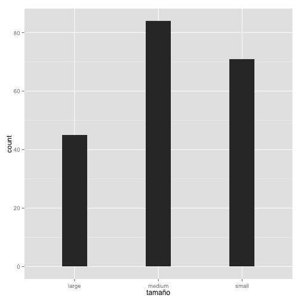
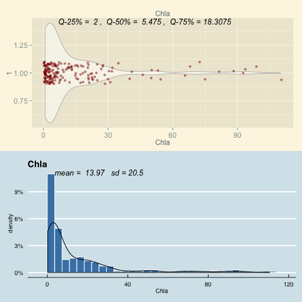

# Exploración


```r
source("0-load.r")
source("2-eda.r")
```

## Exploración general de 5 variables


```r
algas.data  <- load()

eda1(algas.data,c(3,9,5,11,16))
```

```
## Loading required package: dplyr
## 
## Attaching package: 'dplyr'
## 
## The following object is masked from 'package:stats':
## 
##     filter
## 
## The following objects are masked from 'package:base':
## 
##     intersect, setdiff, setequal, union
## 
## Loading required package: scales
## Loading required package: ggplot2
## Loading required package: gridExtra
## Loading required package: grid
## Loading required package: ggthemes
```

 

```
## stat_bin: binwidth defaulted to range/30. Use 'binwidth = x' to adjust this.
```

 

```
## stat_bin: binwidth defaulted to range/30. Use 'binwidth = x' to adjust this.
```

 

```
## stat_bin: binwidth defaulted to range/30. Use 'binwidth = x' to adjust this.
```

 

```
## stat_bin: binwidth defaulted to range/30. Use 'binwidth = x' to adjust this.
```

 

## Exploración gernal, tomando como base a comparar good.loan


```r
eda2(algas.data,2,c(1,6,11,9,6))
```

     

