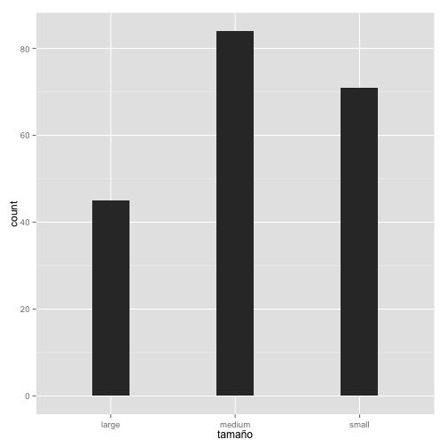

# Introducción

Nuestro archivo a explorar procede del repositorio UCI Machine Learning Repository.
Datos que evaluan caraterísticas de cierto tipo de algas en alguna región de USA.

## Variables

Nuestro dataset está compuesto de 200 observarciones en 18 variables. 3 de las variables son categóricas y 15 son numércias. 8 de las variables numéricas presneta NA`s. 

Las categóricas son : Temporada, tamaño, velocidad.
Algunas numércias son: mxPH, Cl, NO3, NO4, oP4, PO4, etc.


# Estructura General


```r
ds
```

```
## Source: local data frame [200 x 18]
## 
##    temporada tamaño velocidad mxPH mnO2    Cl    NO3    NO4   oPO4    PO4
## 1     winter  small    medium 8.00  9.8 60.80  6.238 578.00 105.00 170.00
## 2     spring  small    medium 8.35  8.0 57.75  1.288 370.00 428.75 558.75
## 3     autumn  small    medium 8.10 11.4 40.02  5.330 346.67 125.67 187.06
## 4     spring  small    medium 8.07  4.8 77.36  2.302  98.18  61.18 138.70
## 5     autumn  small    medium 8.06  9.0 55.35 10.416 233.70  58.22  97.58
## 6     winter  small      high 8.25 13.1 65.75  9.248 430.00  18.25  56.67
## 7     summer  small      high 8.15 10.3 73.25  1.535 110.00  61.25 111.75
## 8     autumn  small      high 8.05 10.6 59.07  4.990 205.67  44.67  77.43
## 9     winter  small    medium 8.70  3.4 21.95  0.886 102.75  36.30  71.00
## 10    winter  small      high 7.93  9.9  8.00  1.390   5.80  27.25  46.60
## ..       ...    ...       ...  ...  ...   ...    ...    ...    ...    ...
## Variables not shown: Chla (dbl), a1 (dbl), a2 (dbl), a3 (dbl), a4 (dbl),
##   a5 (dbl), a6 (dbl), a7 (dbl)
```


## Tamaño

```r
dim(ds)
```

```
## [1] 200  18
```

## Columnas


```r
names(ds)
```

```
##  [1] "temporada" "tamaño"    "velocidad" "mxPH"      "mnO2"     
##  [6] "Cl"        "NO3"       "NO4"       "oPO4"      "PO4"      
## [11] "Chla"      "a1"        "a2"        "a3"        "a4"       
## [16] "a5"        "a6"        "a7"
```

## Estructura


```r
str(ds)
```

```
## Classes 'tbl_df', 'tbl' and 'data.frame':	200 obs. of  18 variables:
##  $ temporada: Factor w/ 4 levels "autumn","spring",..: 4 2 1 2 1 4 3 1 4 4 ...
##  $ tamaño   : Factor w/ 3 levels "large","medium",..: 3 3 3 3 3 3 3 3 3 3 ...
##  $ velocidad: Factor w/ 3 levels "high","low","medium": 3 3 3 3 3 1 1 1 3 1 ...
##  $ mxPH     : num  8 8.35 8.1 8.07 8.06 8.25 8.15 8.05 8.7 7.93 ...
##  $ mnO2     : num  9.8 8 11.4 4.8 9 13.1 10.3 10.6 3.4 9.9 ...
##  $ Cl       : num  60.8 57.8 40 77.4 55.4 ...
##  $ NO3      : num  6.24 1.29 5.33 2.3 10.42 ...
##  $ NO4      : num  578 370 346.7 98.2 233.7 ...
##  $ oPO4     : num  105 428.8 125.7 61.2 58.2 ...
##  $ PO4      : num  170 558.8 187.1 138.7 97.6 ...
##  $ Chla     : num  50 1.3 15.6 1.4 10.5 ...
##  $ a1       : num  0 1.4 3.3 3.1 9.2 15.1 2.4 18.2 25.4 17 ...
##  $ a2       : num  0 7.6 53.6 41 2.9 14.6 1.2 1.6 5.4 0 ...
##  $ a3       : num  0 4.8 1.9 18.9 7.5 1.4 3.2 0 2.5 0 ...
##  $ a4       : num  0 1.9 0 0 0 0 3.9 0 0 2.9 ...
##  $ a5       : num  34.2 6.7 0 1.4 7.5 22.5 5.8 5.5 0 0 ...
##  $ a6       : num  8.3 0 0 0 4.1 12.6 6.8 8.7 0 0 ...
##  $ a7       : num  0 2.1 9.7 1.4 1 2.9 0 0 0 1.7 ...
```

_NOTA: Indicar si hay una discrepancia entre las clases de las variables en el data set y en su significado, i.e. fechas que no son fechas, si no factores, etc._

## Observaciones


```r
head(ds)
```

```
## Source: local data frame [6 x 18]
## 
##   temporada tamaño velocidad mxPH mnO2    Cl    NO3    NO4   oPO4    PO4
## 1    winter  small    medium 8.00  9.8 60.80  6.238 578.00 105.00 170.00
## 2    spring  small    medium 8.35  8.0 57.75  1.288 370.00 428.75 558.75
## 3    autumn  small    medium 8.10 11.4 40.02  5.330 346.67 125.67 187.06
## 4    spring  small    medium 8.07  4.8 77.36  2.302  98.18  61.18 138.70
## 5    autumn  small    medium 8.06  9.0 55.35 10.416 233.70  58.22  97.58
## 6    winter  small      high 8.25 13.1 65.75  9.248 430.00  18.25  56.67
## Variables not shown: Chla (dbl), a1 (dbl), a2 (dbl), a3 (dbl), a4 (dbl),
##   a5 (dbl), a6 (dbl), a7 (dbl)
```


```r
tail(ds)
```

```
## Source: local data frame [6 x 18]
## 
##   temporada tamaño velocidad mxPH mnO2     Cl   NO3    NO4  oPO4    PO4
## 1    summer  large    medium  8.5  7.9  12.44 2.586  96.67 19.11  61.44
## 2    autumn  large    medium  8.4  8.4  17.38 3.833  83.75 53.62  79.75
## 3    spring  large    medium  8.3 10.6  14.32 3.200 125.33 35.33  75.90
## 4    autumn  large    medium  8.2  7.0 139.99 2.978  60.11 78.33 140.22
## 5    winter  large    medium  8.0  7.6     NA    NA     NA    NA     NA
## 6    summer  large    medium  8.5  6.7  82.85 2.800  27.07 64.00 140.52
## Variables not shown: Chla (dbl), a1 (dbl), a2 (dbl), a3 (dbl), a4 (dbl),
##   a5 (dbl), a6 (dbl), a7 (dbl)
```


# Sumario Estadístico


```r
summary(ds)
```

```
##   temporada     tamaño    velocidad       mxPH           mnO2      
##  autumn:40   large :45   high  :84   Min.   :5.60   Min.   : 1.50  
##  spring:53   medium:84   low   :33   1st Qu.:7.70   1st Qu.: 7.72  
##  summer:45   small :71   medium:83   Median :8.06   Median : 9.80  
##  winter:62                           Mean   :8.01   Mean   : 9.12  
##                                      3rd Qu.:8.40   3rd Qu.:10.80  
##                                      Max.   :9.70   Max.   :13.40  
##                                      NA's   :1      NA's   :2      
##        Cl             NO3             NO4             oPO4      
##  Min.   :  0.2   Min.   : 0.05   Min.   :    5   Min.   :  1.0  
##  1st Qu.: 11.0   1st Qu.: 1.30   1st Qu.:   38   1st Qu.: 15.7  
##  Median : 32.7   Median : 2.67   Median :  103   Median : 40.1  
##  Mean   : 43.6   Mean   : 3.28   Mean   :  501   Mean   : 73.6  
##  3rd Qu.: 57.8   3rd Qu.: 4.45   3rd Qu.:  227   3rd Qu.: 99.3  
##  Max.   :391.5   Max.   :45.65   Max.   :24064   Max.   :564.6  
##  NA's   :10      NA's   :2       NA's   :2       NA's   :2      
##       PO4             Chla              a1              a2       
##  Min.   :  1.0   Min.   :  0.20   Min.   : 0.00   Min.   : 0.00  
##  1st Qu.: 41.4   1st Qu.:  2.00   1st Qu.: 1.50   1st Qu.: 0.00  
##  Median :103.3   Median :  5.47   Median : 6.95   Median : 3.00  
##  Mean   :137.9   Mean   : 13.97   Mean   :16.92   Mean   : 7.46  
##  3rd Qu.:213.8   3rd Qu.: 18.31   3rd Qu.:24.80   3rd Qu.:11.38  
##  Max.   :771.6   Max.   :110.46   Max.   :89.80   Max.   :72.60  
##  NA's   :2       NA's   :12                                      
##        a3              a4              a5              a6       
##  Min.   : 0.00   Min.   : 0.00   Min.   : 0.00   Min.   : 0.00  
##  1st Qu.: 0.00   1st Qu.: 0.00   1st Qu.: 0.00   1st Qu.: 0.00  
##  Median : 1.55   Median : 0.00   Median : 1.90   Median : 0.00  
##  Mean   : 4.31   Mean   : 1.99   Mean   : 5.06   Mean   : 5.96  
##  3rd Qu.: 4.92   3rd Qu.: 2.40   3rd Qu.: 7.50   3rd Qu.: 6.92  
##  Max.   :42.80   Max.   :44.60   Max.   :44.40   Max.   :77.60  
##                                                                 
##        a7      
##  Min.   : 0.0  
##  1st Qu.: 0.0  
##  Median : 1.0  
##  Mean   : 2.5  
##  3rd Qu.: 2.4  
##  Max.   :31.6  
## 
```


# Limpieza de metadatos


```r
source("~/itam-dm/alumnos/jtmancilla/german/utils.r")
```

```
## -------------------------------------------------------------------------
## You have loaded plyr after dplyr - this is likely to cause problems.
## If you need functions from both plyr and dplyr, please load plyr first, then dplyr:
## library(plyr); library(dplyr)
## -------------------------------------------------------------------------
## 
## Attaching package: 'plyr'
## 
## The following object is masked from 'package:lubridate':
## 
##     here
## 
## The following objects are masked from 'package:dplyr':
## 
##     arrange, count, desc, failwith, id, mutate, rename, summarise,
##     summarize
```

```r
# Usaremos la función que hiciste de ejercicio
names(ds) <- normalizarNombres(names(ds))
```


Además de normalizar los nombres de variables, este es el lugar para poner nombres que tengan significado como que la columna que tenga datos de fecha, se llame `fecha` o `date`.


```r
names(ds)
```

```
##  [1] "temporada" "tamaño"    "velocidad" "mx.ph"     "mn.o2"    
##  [6] "cl"        "no3"       "no4"       "o.po4"     "po4"      
## [11] "chla"      "a1"        "a2"        "a3"        "a4"       
## [16] "a5"        "a6"        "a7"
```

# Ajuste de formatos

Las clases de las variables son


```r
sapply(ds, class)
```

```
## temporada    tamaño velocidad     mx.ph     mn.o2        cl       no3 
##  "factor"  "factor"  "factor" "numeric" "numeric" "numeric" "numeric" 
##       no4     o.po4       po4      chla        a1        a2        a3 
## "numeric" "numeric" "numeric" "numeric" "numeric" "numeric" "numeric" 
##        a4        a5        a6        a7 
## "numeric" "numeric" "numeric" "numeric"
```


En esta sección arreglamos los formatos de los datos. Un ejemplo típico son las fechas.

Otros problemas con variables son: categóricas/numéricas que no lo son, booleanas que no lo son, ordenar variables nominales, reetiquetar las variables categóricas, etc.

Para arreglar las fechas, utiliza el paquete `lubridate`.

El formato de fechas debe de ser `YMD` y si es `timestamp` debe de serlo hasta la precisión que den los datos, no más, no menos.


*NOTA: Es recomendable hacer todas las transformaciones en un solo `mutate` y no una por una (a menos que haya problemas de memoria, y hay que usar otras técnicas).*

Así quedan las variables corregidas:


```r
sapply(ds, class) 
```

```
## temporada    tamaño velocidad     mx.ph     mn.o2        cl       no3 
##  "factor"  "factor"  "factor" "numeric" "numeric" "numeric" "numeric" 
##       no4     o.po4       po4      chla        a1        a2        a3 
## "numeric" "numeric" "numeric" "numeric" "numeric" "numeric" "numeric" 
##        a4        a5        a6        a7 
## "numeric" "numeric" "numeric" "numeric"
```

# Transformación de variables

En esta sección incluímos la transformación de las variables necesarias (normalización, estandarización, _binning_, `log`, etc.)


*NOTA: Es recomendable hacer todas las transformaciones en un solo `mutate` y no una por una (a menos que haya problemas de memoria, y hay que usar otras técnicas).*
# Identificación de variables


```r
# Aplicando Normalización:

normalizar  <- function(data){
    df  <- data.frame()
    for (n in 1:ncol(data)){
            if(class(data[,n])=="numeric"){
                data$n  <- (data[,n]-mean(data[,n],na.rm=T))/sd(data[,n],na.rm=T)
                
            }
    }
}


normalizar(ds)
```

```
## Warning: the condition has length > 1 and only the first element will be used
## Warning: the condition has length > 1 and only the first element will be used
## Warning: the condition has length > 1 and only the first element will be used
## Warning: the condition has length > 1 and only the first element will be used
## Warning: the condition has length > 1 and only the first element will be used
## Warning: the condition has length > 1 and only the first element will be used
## Warning: the condition has length > 1 and only the first element will be used
## Warning: the condition has length > 1 and only the first element will be used
## Warning: the condition has length > 1 and only the first element will be used
## Warning: the condition has length > 1 and only the first element will be used
## Warning: the condition has length > 1 and only the first element will be used
## Warning: the condition has length > 1 and only the first element will be used
## Warning: the condition has length > 1 and only the first element will be used
## Warning: the condition has length > 1 and only the first element will be used
## Warning: the condition has length > 1 and only the first element will be used
## Warning: the condition has length > 1 and only the first element will be used
## Warning: the condition has length > 1 and only the first element will be used
## Warning: the condition has length > 1 and only the first element will be used
```

```r
vars <- names(ds) # Guardamos los nombres de variables


target <- "tamaño" # Si el modelo es supervisado
#risk <- "" # Si se proveé, es la importancia de la observación respecto a la variable (es una variable de salida)
#costo <- "" # Costo de equivocarse en la predicción (Si se proveé) (es una variable de salida)
id <- vars # Armar una id con columnas, o seleccionar el id del dataset
```

# Recodificación

No aplica para este caso..

Antes de pasar a la etapa de ignorar variables, es importante **recodificar**. 

- Hay métodos como el  `randomForest` que no soporta variables categóricas con más de 32 niveles, habría que agruparlos (e.g. si son países se pueden reagrupar por región, similitud -esto requiere otra base de datos, etc.)

- Si las fechas son `timestamp` hay que extraer variables categóricas como `mes`, `día.de.la.semana`, `fin.de.semana`, `temporada`, etc. claro que depende del tipo del problema al que nos estemos enfrentando.


# Variables a ignorar

No aplicaca en este caso..

Identificamos en una variable, las columnas a ignorar en el entrenamiento del modelo.

### IDs y variables de salida


```r
vars.a.ignorar <- id #union(id,if (exists("risk")) risk, if (exists("costo")) costo)
```

### Constantes y valores únicos por observación


```r
# Ignoramos las que tengan un único valor por cada observación, pueden ser IDs
# IMPORTANTE: Esto puede eliminar fechas, ver sección anterior

ids <- names(which(sapply(ds, function(x) length(unique(x)) == nrow(ds))))

# Ignoramos los factores que tengan muchos niveles
# IMPORTANTE: ver sección anterior

factors <- which(sapply(ds[vars], is.factor))
niveles <- sapply(factors, function(x) length(levels(ds[[x]])))
(muchos.niveles <- names(which(niveles > 20)))

vars.a.ignorar <- union(vars.a.ignorar, muchos.niveles)

# Constantes
constantes <- names(which(sapply(ds[vars], function(x) all(x == x[1L]))))

var.a.ignorar <- union(vars.a.ignorar, ids, constantes)
```


### Faltantes


```r
# Las que sean puros NAs
ids.nas.count <- sapply(ds[vars], function(x) sum(is.na(x)))
ids.nas <- names(which(ids.nas.count == nrow(ds)))

vars.a.ignorar <- ids.nas #union(ids.nas, vars.a.ignorar)

# Las que tengan muchos NAs (un 70% o más)
ids.many.nas <- names(which(ids.nas.count >= 0.7*nrow(ds)))

vars.a.ignorar <- union(ids.many.nas, vars.a.ignorar)
```

### Variable de salida (`target`) 

Si el problema de minado, es supervisado, removemos las observaciones que tengan `NA` en la variable `target`


```r
dim(ds)
```

```
## [1] 200  18
```

```r
ds <- ds[!is.na(ds[target]),]
dim(ds)
```

```
## [1] 200  18
```

Si el problema es de clasificación, hay que convertir la variable `target` a categórica.


```r
ds[target] <- as.factor(ds[[target]])
table(ds[target])
```

```
## 
##  large medium  small 
##     45     84     71
```

Mostramos la distribución (esto nos indicará si el problema no está balanceado)


```r
ggplot(data=ds, aes_string(x=target)) + geom_bar(width=0.3)
```

 


# Variables correlacionadas


```r
vars.cor <- cor(ds[which(sapply(ds, is.numeric))], use="complete.obs")
vars.cor[upper.tri(vars.cor, diag=TRUE)] <- NA

vars.cor <- vars.cor                                  %>%
            abs()                                     %>%   
            data.frame()                              %>%
            mutate(var1=row.names(vars.cor))          %>%
            gather(var2, cor, -var1)                  %>%
            na.omit()
            

vars.cor <- vars.cor[order(-abs(vars.cor$cor)), ]

(muy.cor <- filter(vars.cor, cor > 0.95)) # Mostramos las que tengan más del 95% de correlación
```

```
## [1] var1 var2 cor 
## <0 rows> (or 0-length row.names)
```

```r
# Habría que decidir si se remueven y cuales se remueven (var1 o var2)
vars.a.ignorar <- union(vars.a.ignorar, muy.cor$var2)
```

En esta base de observación no tenemos ninguna variable con una correlación igual o mayro
al 95%.

_NOTA: ¿Qué pasa con las categóricas? ¿Usamos asociación o independencia?_


# Valores faltantes

Se elimiarán las observaciones: 62 y 199 por tener un alto % de NA en el registro.


```r
observaciones.omitidas  <- ds[apply(ds, 1, function(x) sum(is.na(x))) > 2,]

ds <- ds[-c(199,62),]
```


Para los valores faltantes de la columna PO4 utilizaremos una regresión lineal, utilizando
a oPO4 como covariable.

```r
lm  <- predict(lm(po4 ~ o.po4, data=ds))
ds$po4 <-  ifelse(!is.na(ds[,"po4"]),ds[,"po4"],lm)
```

Para el resto de las columnas con NA`s se imputara con el promedio.


```r
#Creando función

imputarValorCentral <- function(data, colnames){
    for(n in colnames){
        if(class(data[,n])=="factor"){
            
            vec  <- ifelse(!is.na(data[,n]),data[,n],
                             names(table(data[,n]))[max(table(data[,n])) == table(data[,n])])
            
            data[,n]   <-  mapvalues(vec,from=1:nlevels(data[,n]), to=levels(data[,n]))  
        }
        else{
            data[,n]   <-  ifelse(!is.na(data[,n]),data[,n],mean(data[,n],na.rm=T))
            
        }
    }
}

imputarValorCentral(ds,c("mx.ph","mn.o2","cl","chla"))                    
```

```
## Warning: the condition has length > 1 and only the first element will be used
## Warning: provided 198 variables to replace 1 variables
## Warning: the condition has length > 1 and only the first element will be used
## Warning: provided 198 variables to replace 1 variables
## Warning: the condition has length > 1 and only the first element will be used
## Warning: provided 198 variables to replace 1 variables
## Warning: the condition has length > 1 and only the first element will be used
## Warning: provided 198 variables to replace 1 variables
```


# Normalizar niveles

Removemos espacios, puntuaciones, camelCase, etc. en los niveles de los factores supervivientes.


```r
factors <- which(sapply(ds[vars], is.factor))
for (f in factors) levels(ds[[f]]) <- normalizarNombres(levels(ds[[f]]))
```


# Identificación de Variables


```r
(vars.input <- setdiff(vars, target))
```

```
##  [1] "temporada" "velocidad" "mx.ph"     "mn.o2"     "cl"       
##  [6] "no3"       "no4"       "o.po4"     "po4"       "chla"     
## [11] "a1"        "a2"        "a3"        "a4"        "a5"       
## [16] "a6"        "a7"
```

```r
idxs.input <- sapply(vars.input, function(x) which(x == names(ds)), USE.NAMES=FALSE)

idxs.numericas <- intersect(idxs.input, which(sapply(ds, is.numeric)))
(vars.numericas <- names(ds)[idxs.numericas])
```

```
##  [1] "mx.ph" "mn.o2" "cl"    "no3"   "no4"   "o.po4" "chla"  "a1"   
##  [9] "a2"    "a3"    "a4"    "a5"    "a6"    "a7"
```

```r
idxs.categoricas <- intersect(idxs.input, which(sapply(ds, is.factor)))
(vars.categoricas <- names(ds)[idxs.categoricas])
```

```
## [1] "temporada" "velocidad"
```

```r
# Por conveniencia guardamos el número de observaciones supervivientes
num.observaciones <- nrow(ds)
```


### Apéndice: Ambiente


```
## R version 3.1.1 (2014-07-10)
## Platform: x86_64-apple-darwin13.1.0 (64-bit)
## 
## locale:
## [1] en_US.UTF-8/en_US.UTF-8/en_US.UTF-8/C/en_US.UTF-8/en_US.UTF-8
## 
## attached base packages:
## [1] grid      stats     graphics  grDevices utils     datasets  methods  
## [8] base     
## 
## other attached packages:
##  [1] plyr_1.8.1      stringr_0.6.2   lubridate_1.3.3 tidyr_0.1      
##  [5] ggthemes_1.7.0  gridExtra_0.9.1 ggplot2_1.0.0   scales_0.2.4   
##  [9] dplyr_0.3.0.2   knitr_1.6      
## 
## loaded via a namespace (and not attached):
##  [1] assertthat_0.1   colorspace_1.2-4 DBI_0.3.1        digest_0.6.4    
##  [5] evaluate_0.5.5   formatR_0.10     gtable_0.1.2     labeling_0.2    
##  [9] lazyeval_0.1.9   magrittr_1.0.1   markdown_0.7.2   MASS_7.3-33     
## [13] memoise_0.2.1    mime_0.1.2       munsell_0.4.2    parallel_3.1.1  
## [17] proto_0.3-10     Rcpp_0.11.2      reshape2_1.4     tools_3.1.1
```

